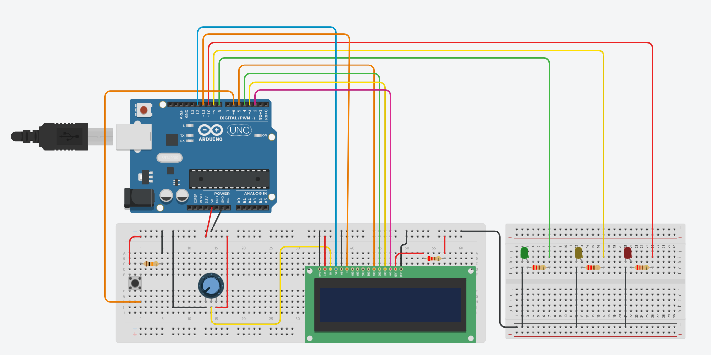

# Semaphore

This app demonstrates how to use a LCD display, LEDs and buttons with Arduino Uno R3 board.

I implemented a traffic light. When the green LED is on, the car moves forward. After a few seconds, the green LED blinks and then the yellow one lights up. At this moment, both the man and the car stand still. When the red LED is on, the car stops, and the man can move forward with the help of the button.

## Demo
https://user-images.githubusercontent.com/87378430/229549528-5b5d0160-78ed-4de8-9cf8-cc5f7ac84b1f.mp4

## Schematics

[Tinkercad schematics](https://www.tinkercad.com/things/ctNQCkQFn1F?sharecode=dOPsBRbDQzCKx5KTBKh-yCNS_g42kYPNx78rrCQlbjk)

## Pre-requisites

- Arduino Uno R3 board
- Arduino IDE
- The following individual components:
    - 1 LCD 16 x 2 https://www.sigmanortec.ro/LCD-1602-p125700685
    - 1 Green LED https://www.sigmanortec.ro/LED-3mm-p125814530
    - 1 Yellow LED https://www.sigmanortec.ro/LED-3mm-p125814530
    - 1 Red LED https://www.sigmanortec.ro/LED-3mm-p125814530
    - 1 Pushbutton https://www.sigmanortec.ro/buton-mini-6x6x5-4-pini
    - 4 220 Ω Resistors https://www.sigmanortec.ro/kit-rezistori-30-valori-20-bucati
    - 1 10 kΩ Resistor https://www.sigmanortec.ro/kit-rezistori-30-valori-20-bucati
    - 1 10 kΩ Potentiometer https://www.sigmanortec.ro/Potentiometru-1K-5K-10K-20K-50K-100K-p136286400
    - Jumper wires https://www.sigmanortec.ro/40-Fire-Dupont-30cm-Tata-Mama-p210854349
    - 1 normal breadboard and 1 small breadboard https://www.sigmanortec.ro/Breadboard-400-puncte-p129872825

## Setup and Build

Install Arduino IDE.

## Running

To run the app on Arduino Uno R3 board:

1. Connect the components according to the schematics bellow
2. Connect the board to your laptop and run the code
